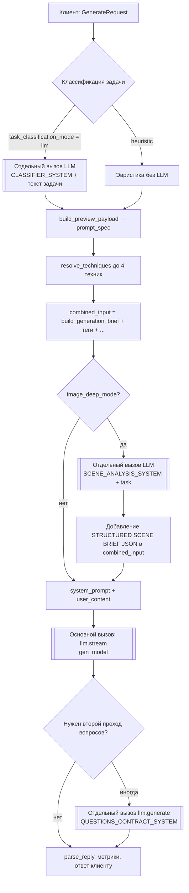

# Режим «Фото»: сборка промптов, отдельные вызовы LLM и анализ затрат токенов

Индекс актуальной документации: [`../current/README.md`](../current/README.md). После изменений в `backend/api/generate.py` / Home сверяйте этот файл.

**Назначение документа:** дать аналитику и продукту полную картину того, **из каких блоков складывается контекст** при генерации в режиме изображения, **какие запросы к API выполняются последовательно или параллельно по смыслу**, где **повторяется смысл**, и какие **рычаги** можно рассматривать для снижения стоимости — **без изменения кода** (только описание текущего поведения по состоянию кодовой базы).

**Эмпирическая опора (пример из логов пользователя):**

| Вызов | Модель (по логу) | Input tokens | Output tokens | Назначение |
|--------|------------------|--------------|---------------|------------|
| 1 | DeepSeek V3 (основной `gen_model`) | **~2415** | **~453** | Потоковая генерация ответа с `[REASONING]` + `[QUESTIONS]` или `[PROMPT]` |
| 2 | Gemini 2.0 Flash | **~221** | **~92** | Анализ сцены (`image_deep_mode`), JSON-краткое описание |

Суммарно на один пользовательский клик «Сгенерировать» в типичной конфигурации (фото + глубокий режим + анализ сцены): **входные токены ≈ 2415 + 221 ≈ 2636** только по двум вызовам (плюс возможные дополнительные вызовы — см. раздел 4).

---

## 1. Область применения и типичный сценарий

Речь о запросе **`POST /generate`** (`backend/api/generate.py`, функция `generate_prompt`), когда:

- `prompt_type == "image"`
- включён **`image_deep_mode`** (анализ сцены отдельным вызовом)
- включён **`questions_mode`**, нет `question_answers`, нет `previous_prompt` — **первичная генерация с уточнениями**
- выбраны **метки стиля** (`image_prompt_tags`) — например две
- `image_engine` с фронта часто **`auto`** (см. `frontend/src/pages/Home.tsx`)

Другие режимы (текст, скилл, итерация по промпту, ответы на вопросы) ниже упоминаются только там, где отличается сборка.

---

## 2. Высокоуровневая схема потока



---

## 3. Пошаговая «симуляция» итогового запроса к основной модели (`llm.stream`)

Ниже — **логический порядок**, в котором приложение **собирает две строки**, передаваемые в OpenRouter: **`system_prompt`** и **`user_content`**. Именно их суммарный размер (плюс служебная обвязка провайдера) определяет **input tokens** основного вызова.

### 3.1. Переменная `combined_input` (позже станет основой `user_content`)

Источник: `backend/api/generate.py` (после `build_generation_brief` и дополнений).

| Шаг | Что добавляется | Файл / функция | Смысл |
|-----|-------------------|----------------|-------|
| 1 | Текст **«СТРУКТУРИРОВАННАЯ СПЕЦИФИКАЦИЯ ЗАДАЧИ»** + поля из `prompt_spec` (цель, типы задач, сложность, ограничения, критерии, источник истины, workspace…) + блок **«ИСХОДНЫЙ ЗАПРОС ПОЛЬЗОВАТЕЛЯ»** с **полным** `task_input` | `core/prompt_spec.py` → `build_generation_brief` | Дублирует смысл задачи в «структурированном» виде и **ещё раз** даёт тот же запрос как `input_description` |
| 2 | При наличии: **«Ответы на уточняющие вопросы»** | `generate.py` | В первичном фото-режиме с вопросами обычно **пусто** |
| 3 | При наличии: **«Комментарий к улучшению»** (`feedback`) | `generate.py` | Для первичной генерации часто пусто |
| 4 | Блок **меток стиля**: строки `- (tag_id) …` под каждую метку из `IMAGE_TAG_INSTRUCTIONS` | `core/image_style_tags.py` → `expand_image_tags_to_directives` | Длинные заранее заданные описания стиля (**сотни символов на метку**) |
| 5 | Если `image_deep_mode` и JSON распарсился: **`--- STRUCTURED SCENE BRIEF ---`** + `json.dumps(..., indent=2)` + конец маркера | `generate.py` | Повторяет и **формализует** то, что уже есть в задаче + в метках; увеличивает объём за счёт отступов JSON |

**Важно:** `combined_input` **не** включает системные инструкции про `[PROMPT]`/`[QUESTIONS]` — они живут только в `system_prompt`.

---

### 3.2. Сборка `system_prompt` через `ContextBuilder.build_system_prompt`

Источник: `core/context_builder.py`, метод `build_system_prompt`, затем **дописки** в `generate.py`.

Порядок частей внутри `build_system_prompt` (через `"\n\n".join(parts)`):

| # | Блок | Константа / источник | Назначение |
|---|------|----------------------|------------|
| A | **Базовый системный промпт** | `BASE_SYSTEM_PROMPT` | Роль prompt engineer, протокол `[REASONING]` / `[QUESTIONS]` / `[PROMPT]`, язык, анти-мета, запреты |
| B | **Скоуп + карточка целевой модели** | `TARGET_GUIDANCE_SCOPE` + `get_target_model_guidance_block(target_model)` из `core/target_model_cards.py` | Подсказки **как писать внутри `[PROMPT]`** под семейство модели (размер — от **пусто** для `unknown` до сотни+ символов) |
| C | **Домен** | `get_domain_checklist` | Только если `domain != "auto"` — в типичном «auto» **не добавляется** |
| D | **Режим вопросов (общий)** | `QUESTIONS_MODE_STRONG` | Усиливает склонность к `[QUESTIONS]` при неполноте |
| E | **Активные техники** | Заголовок + `TechniqueRegistry.build_technique_context(..., prompt_type="image")` — `core/technique_registry.py` | До **4** карточек; для image предпочтительно поле **`image_variant`** (why + шаблон). Это **крупнейший переменный** кусок system после базы |
| F | **Предпочтения пользователя** | `_format_preferences` | В `generate_prompt` **не передаются** `user_preferences` → блок **обычно отсутствует** |
| G | **Контекст сессии** | `session_summary` | **Не передаётся** из `generate.py` → **отсутствует** |
| H | **Скелет тегов** | `FORMAT_SKELETON_SNIPPET` | Мини-пример правильного ответа |
| I | **Хвост контракта** | `SYSTEM_PROMPT_TAIL` | Закрепление формата |

После возврата из `build_system_prompt` в **`generate.py`** для режима image последовательно **дописывается**:

| # | Блок | Константа / функция | Когда |
|---|------|---------------------|--------|
| J | **Политика контекста** | `--- CONTEXT POLICY (gap=...) ---` | Если первичная генерация с вопросами и `questions_policy["mode"] != "skip"` (`core/context_gap.py` вычисляет `gap` и `max_questions`) |
| K | **Режим изображения** | `IMAGE_PROMPT_MODE_BLOCK` | Всегда для `prompt_type == "image"` |
| L | **Уточнения для картинок** | `IMAGE_QUESTIONS_APPEND` | Если `questions_mode` |
| M | **Синтаксис целевого движка** | `get_image_engine_syntax_block(req.image_engine)` — `core/image_target_syntax.py` | Для `auto` — **короткий** абзац |
| N | **Активный пресет стиля** | `format_active_style_preset_system_block` — `core/image_presets.py` | Если выбран `image_preset_id` |
| O | **Строгие уточнения (фото)** | `IMAGE_QUESTIONS_STRICT` | Если первичная генерация с неотвеченными вопросами |

Дополнительно (редко / по условиям): `skill_body`, `CLARIFICATION_ANSWERS_PROVIDED` — для описанного «первого фото с вопросами» обычно **нет**.

---

### 3.3. Сборка `user_content` — `build_user_content`

Источник: `core/context_builder.py`.

| Компонент | Условие |
|-----------|---------|
| Строка **классификации** (`[Классификация (LLM|эвристика): тип — …, сложность — …]`) | Всегда если в `classification` есть поля |
| Либо пара «текущий промпт + правки», либо **одна большая строка** `user_prompt` | Для первичной генерации — это **`combined_input`** целиком |

Итог: **user message** = (опционально короткая классификация) + **весь бриф, теги, JSON сцены**.

---

### 3.4. Виртуальная «склейка» для аналитика (одна строка для оценки размера)

Для понимания **почему input стабильно ~2400–2700 токенов**, удобно мысленно представить:

```text
[ SYSTEM ]
  BASE_SYSTEM_PROMPT
  + TARGET_GUIDANCE_SCOPE + карточка целевой модели (если не unknown)
  + QUESTIONS_MODE_STRONG
  + АКТИВНЫЕ ТЕХНИКИ (до 4 × развёрнутые карточки для image)
  + FORMAT_SKELETON_SNIPPET
  + SYSTEM_PROMPT_TAIL
  + CONTEXT POLICY (часто для коротких задач)
  + IMAGE_PROMPT_MODE_BLOCK
  + IMAGE_QUESTIONS_APPEND
  + IMAGE ENGINE (auto)
  + [опционально] ACTIVE STYLE PRESET
  + IMAGE_QUESTIONS_STRICT

[ USER ]
  + [Классификация: …]
  + build_generation_brief (спека + ПОВТОР полного task_input)
  + expand_image_tags_to_directives (1–N длинных директив)
  + STRUCTURED SCENE BRIEF (pretty-printed JSON)
```

Оценка порядка величины (оценочно, без привязки к конкретному токенизатору):

- Фиксированные русско-английские блоки **BASE + формат + image-блоки + строгие вопросы** дают **большой нижний порог** (сотни токенов только на инструкции).
- **Техники** (до 4) легко добавляют **сотни–тысячу+** токенов в зависимости от наполнения `image_variant` в данных реестра.
- **User** несёт **двойное описание задачи** (спека + `input_description`) и **JSON сцены** поверх текста.

Отсюда **узкий коридор 2400–2700 input** на типичных настройках: основной вклад — **системные константы + техники + удлинённый user**.

---

## 4. Отдельные вызовы LLM (не входят в «одну строку» stream)

### 4.1. Анализ сцены (`image_deep_mode`)

- **Вызов:** `llm.generate`, не stream.
- **System:** `SCENE_ANALYSIS_SYSTEM` (`generate.py`) — английский, фиксированный текст с требованием одного JSON и списком ключей.
- **User:** `_scene_analysis_user_text` — **сырой** `task_input` (+ уточнения/feedback при наличии).
- **Результат:** строка `raw_scene` → парсинг `_extract_json_object` → при успехе добавление в `combined_input` как **отдельный большой блок**.

**Связь с логами:** **~221 input token** хорошо согласуется с **коротким system** + **одним пользовательским описанием**; **~92 output** — компактный JSON с 7 строковыми полями.

**Дублирование смысла:** тот же сюжет пользователя обрабатывается **дважды текстом** — в вызове сцены и затем снова в основном user message (спека + JSON).

---

### 4.2. Классификация задачи через LLM (опционально)

- Условие: в профиле пользователя `task_classification_mode == "llm"` (`prefs_row` в `generate.py`).
- **System:** `CLASSIFIER_SYSTEM` — `core/task_llm_classifier.py`.
- **User:** `Текст задачи пользователя:\n---\n{task_input до 12000 символов}\n---`.

Отдельный счётчик токенов и стоимости — **ещё один** запрос к API (модель из настроек, с ограничениями на пробном ключе).

---

### 4.3. Второй проход «контракт вопросов» (редко, но важно для бюджета)

- Условие: после основного stream модель вернула **`[PROMPT]`**, но сработала эвристика `_should_enforce_questions_contract` (`generate.py`).
- **System:** `QUESTIONS_CONTRACT_SYSTEM`.
- **User:** `User task` + `Identified gaps` из `gap_missing_summary` + лимит вопросов.

Это **ещё один полный** `llm.generate` **после** основного — в логах может выглядеть как третья строка в тот же момент времени.

---

## 5. Повторения, пересечения смысла и «лишний» объём

Ниже — **не баги**, а **наблюдения для оптимизации** на уровне продуктовых решений.

| Область | Что повторяется | Почему это бьёт по токенам |
|---------|-----------------|----------------------------|
| Задача пользователя | В `build_generation_brief` поле **«Исходный запрос»** = тот же текст, что уже в цели/ограничениях логически | User раздувается **без новой информации** |
| Сцена | Сырой `task_input` → JSON в **scene** → снова в спецификации и внутри секций image-инструкций | Тройное представление одного смысла |
| Визуальные параметры | `IMAGE_PROMPT_MODE_BLOCK` (секции Subject/Style/…) + `IMAGE_QUESTIONS_APPEND` (aspect ratio, style, lighting…) + `IMAGE_QUESTIONS_STRICT` (соотношение сторон, стиль, палитра, свет…) | **Три слоя** про одни и те же оси (композиция, стиль, свет) |
| Общий vs фото режим вопросов | `QUESTIONS_MODE_STRONG` + все image-специфичные блоки | Дублирование «лучше спросить, чем угадывать» |
| Техники vs метки стиля | Карточки техник (`image_variant`) могут пересекаться по смыслу с длинными `IMAGE_TAG_INSTRUCTIONS` | Риск **семантического overlap** при автоподборе техник |
| Политика gap | `CONTEXT POLICY` + пороги из `core/context_gap.py` + строгие image-правила | Дополнительный абзац к уже жёсткому `IMAGE_QUESTIONS_STRICT` |
| Карточка целевой модели | `TARGET_MODEL_CARDS` ориентированы на **текстовые** промпты для LLM; в image-режиме часть советов может быть **слабее релевантна** визуальному `[PROMPT]` | Плата за контекст без пропорциональной пользы для картинки |

---

## 6. Связь метрик в приложении с реальными input tokens (важно для аналитики)

В `generate.py` для **пробного ключа** (`using_host_key`) учёт использования после успешного `[PROMPT]` использует **`token_estimate` из `analyze_prompt` по полю `prompt_block`**, а не размер **фактического** `system_prompt + user_content`.

Это значит: **внутренняя метрика «токены» не равна billable input tokens** основного вызова. Для оптимизации затрат ориентироваться нужно на **логи провайдера** (как в вашей таблице), а не только на UI-оценку.

---

## 7. Рычаги оптимизации (для обсуждения продуктом; реализация не входит в этот документ)

Сгруппировано по зонам воздействия:

1. **Системный промпт:** сокращение или слияние блоков `IMAGE_*`, вынос «скелета» в короткую версию для image, уменьшение дублирования между общим режимом вопросов и image-строгим блоком.
2. **Техники:** снижение `max_techniques` для image, отдельные «лёгкие» карточки для `prompt_type=image`, отключение техник в авто-режиме для коротких задач.
3. **User message:** не дублировать полный `task_input` в спецификации, если уже есть сцена/метки; **компактный** JSON без `indent=2` для scene brief.
4. **Цепочка вызовов:** объединение scene + main в одну модель (дороже по качеству/риску), или наоборот — **отказ** от scene для коротких запросов по порогу `gap`/длины.
5. **Классификатор:** держать эвристику по умолчанию для image, если LLM-классификация даёт мало value за отдельный запрос.
6. **Второй проход вопросов:** сделать реже срабатывающим или более дешёвой моделью — уже частично заложено выбором `q_provider`.

---

## 8. Индекс файлов исходного кода

| Тема | Путь |
|------|------|
| Оркестрация, scene, image-блоки, contract | `backend/api/generate.py` |
| Базовый system, user content | `core/context_builder.py` |
| Спецификация и бриф | `core/prompt_spec.py` |
| Метки стиля | `core/image_style_tags.py` |
| Синтаксис движка изображений | `core/image_target_syntax.py` |
| Пресеты | `core/image_presets.py` |
| Карточки целевой модели | `core/target_model_cards.py` |
| Техники | `core/technique_registry.py` |
| Gap и политика вопросов | `core/context_gap.py` |
| LLM-классификатор | `core/task_llm_classifier.py` |
| Выбор техник, спека | `services/prompt_workflow.py` |
| Клиент OpenRouter | `services/llm_client.py` |
| Запрос с фронта | `frontend/src/pages/Home.tsx`, `frontend/src/api/client.ts` |

---

## 9. Вывод для аналитика

Типичные **2400–2700 input** на основной вызов в фото-режиме — следствие **толстого фиксированного system** (база + image-инструкции + режим вопросов + строгие правила) и **переменного слоя техник**, плюс **раздутый user** за счёт структурированной спеки, меток и **JSON сцены**. Отдельные **~200+200 токенов** на анализ сцены — **второй независимый запрос**, который дополнительно **дублирует** содержательно то, что потом снова читает основная модель.

Документ можно использовать как **чек-лист**: для каждого блока из разделов 3–4 зафиксировать **объём в символах/токенах** на репрезентативных задачах и решить, что из перечня в разделе 7 даёт максимум экономии при приемлемом качестве.

---

*Документ подготовлен как статический снимок логики репозитория; при изменении констант или порядка сборки обновите разделы 3–4 по фактическому коду.*
